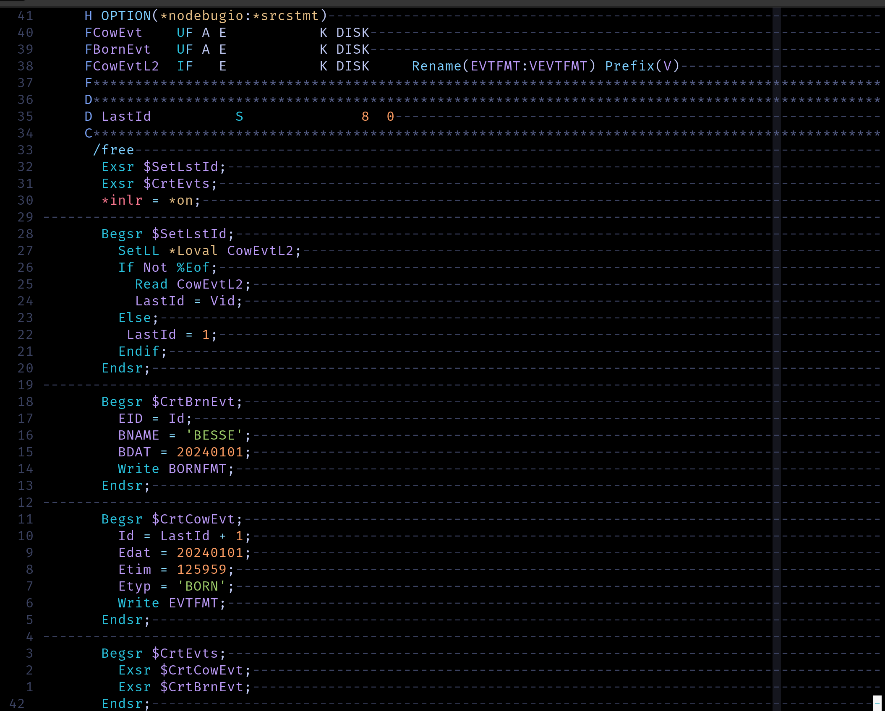

# IDK - Language Tooling for IBM i

## Neovim Syntax Highlighter


## CLI Source Code Visualization

### text-tree renderer

```
$ idk-graph text-tree demo.rpgle
MAIN
  $SetLstId
  $CrtEvts
    $CrtCowEvt
    $CrtBrnEvt
```

### dot renderer

input:


Run idk-graph:

```bash
idk-graph dot ./demo.rpgle > ./graph.gv
dot -Tsvg ./graph.gv > ./graph.svg
```

Output:


## Download source files from IBM i

```sh
$ DSN=AS400 idk-get "ZWAITE/QRPGLESRC(ZEVT)" | idk-fmt RPG
```
