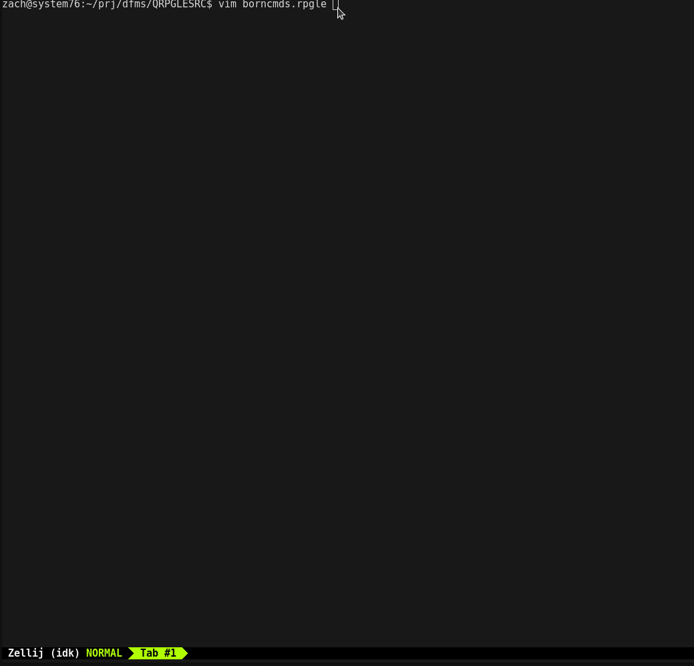
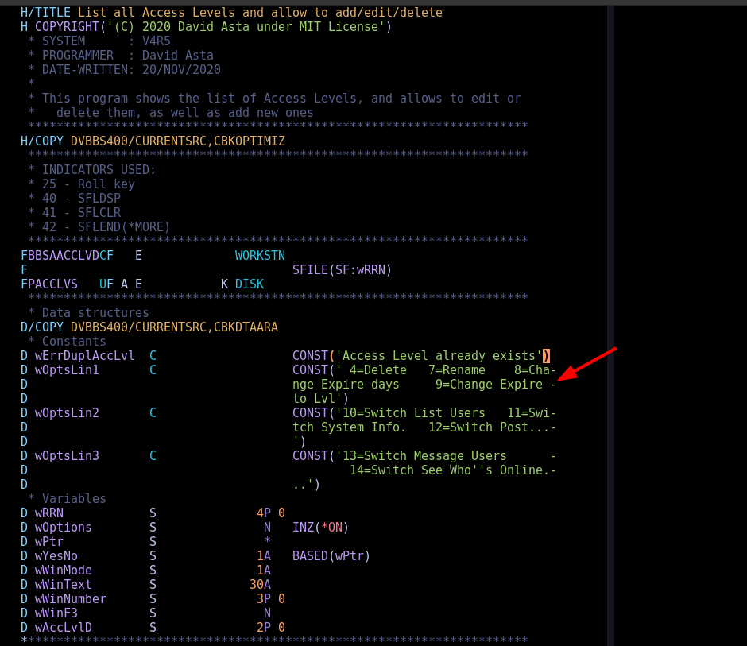
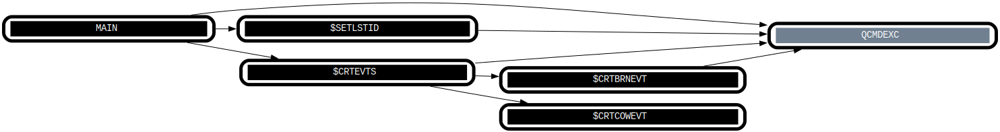

# IDK

IBM i development tools, for Neovim and the command line.

#### Components:

- `idk.nvim` (WIP) - a Neovim plugin that works like a language server,
  without the server
- `idk-get` (READY) - download source files from an IBM i server via ODBC
- `idk-fmt` (READY) - format source files to the proper column width based on
  language
- `rpgle-parser` (WIP) - a parser for different flavors of RPG. Designed to
  handle programs with `/free` and tradition syntax mixed together without
  mercy.
- `dds-parser` (WIP) - a parser for DDS files
- `idk-graph` (WIP) - a source graph generator that outputs dot files to be
  rendered with graphviz
- `idk-lint` (TODO) - someday there will be a linter

## idk-nvim

`idk-nvim` is a Neovim plugin that currently provides syntax highlighting and
basic jump to definition. The core functionality is written in Rust, and
compiled into a shared library for plugin usage via `nvim-oxi`.

###### Jump to definition



###### Syntax Highlighting



###### JSON serialization

Run `:lua require("idk").json_dump_current_buffer("/tmp/dump.json")` to dump the concrete
syntax tree (CST) to a json file. Then use `jq` or a programming language to query the
CST.

###### DOT/Graphviz serialization

The source graph currently visualizes subroutine and external procedure calls as a directed
graph. This is useful for a high level view of control flow when you have to get up to
speed on an existing program.

Run `:lua require("idk").dot_dump_current_buffer("/tmp/dump.gv")` on an open RPG
source file to get a graphviz file. From there run e.g. `dot -Tsvg /tmp/dump.gv > /tmp/dump.svg`
to generate the graph.




## Download source files from IBM i

```sh
$ DSN=AS400 idk-get "ZWAITE/QRPGLESRC(ZEVT)" | idk-fmt RPG
```

