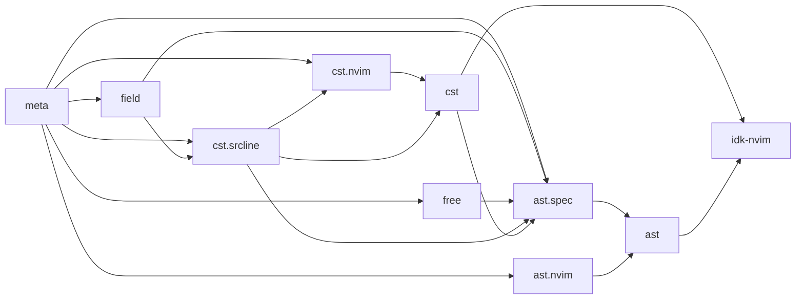

# IDK

IBM i development tools, for Neovim and the command line.

#### Components:

- `idk.nvim` - a Neovim plugin that works like a language server,
  without the server
- `idk-get` - download source files from an IBM i server via ODBC
- `idk-fmt` - format source files to the proper column width based on
  language
- `rpgle-parser` - a parser for different flavors of RPG. Designed to
  handle programs with `/free` and tradition syntax mixed together without
  mercy. Still a work in progress, but good enough to power "jump to definition"
  on most of the /free and traditional fixed format programs I encounter.
- `dds-parser` - a parser for DDS files. Similar status to the rpg parser.
- `idk-graph` - a source graph generator that outputs dot files to be
  rendered with graphviz.

## idk-nvim

`idk-nvim` is a Neovim plugin that currently provides syntax highlighting and
basic jump to definition. The core functionality is written in Rust, and
compiled into a shared library for plugin usage via `nvim-oxi`.

###### Jump to definition

Supported jumps:

- local variable usage -> DSpec definition
- subroutine `Exsr` calls -> `Begsr` definition in traditional or `/free` syntax
- field usage -> field definition in a DDS file registered in the project manifest

Not yet supported:
- prefixed field name -> field definition
- external program call -> external program source file


###### Syntax Highlighting


###### JSON serialization

Run `:lua require("idk").json_dump_current_buffer("/tmp/dump.json")` to dump the concrete
syntax tree (CST) to a json file. Then use `jq` or a programming language to query the
CST.

###### DOT/Graphviz serialization

The source graph currently visualizes subroutine and external procedure calls as a directed
graph. This is useful for a high level view of control flow when you have to get up to
speed on an existing program.

Run `:lua require("idk").dot_dump_current_buffer("/tmp/dump.gv")` on an open RPG
source file to get a graphviz file. From there run e.g. `dot -Tsvg /tmp/dump.gv > /tmp/dump.svg`
to generate the graph.


## Download source files from IBM i

Handy for getting source code onto your system versus working with SEU.

```sh
$ DSN=AS400 idk-get "ZWAITE/QRPGLESRC(ZEVT)" | idk-fmt RPG
```

## Dependency Graph


