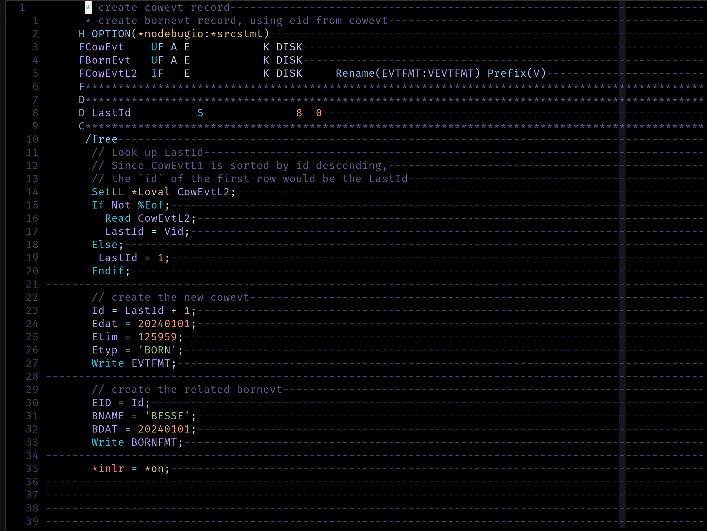
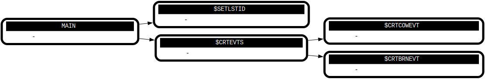

# IDK - Language Tooling for IBM i

## Syntax Highlighter



## Source Graph

### text-tree renderer

```
$ idk-graph text-tree demo.rpgle
MAIN
  $SetLstId
  $CrtEvts
    $CrtCowEvt
    $CrtBrnEvt
```

### dot renderer

input:
```rpgle
     H OPTION(*nodebugio:*srcstmt)                                                                  
     FCowEvt    UF A E           K DISK                                                             
     FBornEvt   UF A E           K DISK                                                             
     FCowEvtL2  IF   E           K DISK     Rename(EVTFMT:VEVTFMT) Prefix(V)                        
     F**********************************************************************************************
     D**********************************************************************************************
     D LastId          S              8  0                                                          
     C**********************************************************************************************
      /free                                                                                         
       Exsr $SetLstId;                                                                              
       Exsr $CrtEvts;                                                                               
       *inlr = *on;                                                                                 
                                                                                                    
       Begsr $SetLstId;                                                                             
         SetLL *Loval CowEvtL2;                                                                     
         If Not %Eof;                                                                               
           Read CowEvtL2;                                                                           
           LastId = Vid;                                                                            
         Else;                                                                                      
          LastId = 1;                                                                               
         Endif;                                                                                     
       Endsr;                                                                                       
                                                                                                    
       Begsr $CrtBrnEvt;                                                                            
         EID = Id;                                                                                  
         BNAME = 'BESSE';                                                                           
         BDAT = 20240101;                                                                           
         Write BORNFMT;                                                                             
       Endsr;                                                                                       
                                                                                                    
       Begsr $CrtCowEvt;                                                                            
         Id = LastId + 1;                                                                           
         Edat = 20240101;                                                                           
         Etim = 125959;                                                                             
         Etyp = 'BORN';                                                                             
         Write EVTFMT;                                                                              
       Endsr;                                                                                       
                                                                                                    
       Begsr $CrtEvts;                                                                              
         Exsr $CrtCowEvt;                                                                           
         Exsr $CrtBrnEvt;                                                                           
       Endsr;                                                                                       
```

Run idk-graph:

```bash
idk-graph dot ./demo.rpgle > ./graph.gv
dot -Tsvg ./graph.gv > ./graph.svg
```

Output:


